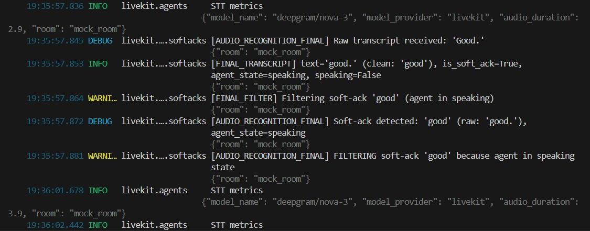

<!--BEGIN_BANNER_IMAGE-->

<picture>
  <source media="(prefers-color-scheme: dark)" srcset="/.github/banner_dark.png">
  <source media="(prefers-color-scheme: light)" srcset="/.github/banner_light.png">
  
</picture>

<!--END_BANNER_IMAGE-->
<br />


[](https://pepy.tech/projects/livekit-agents)
[](https://livekit.io/join-slack)
[](https://twitter.com/livekit)
[](https://deepwiki.com/livekit/agents)
[](https://github.com/livekit/livekit/blob/master/LICENSE)

<br />

Looking for the JS/TS library? Check out [AgentsJS](https://github.com/livekit/agents-js)

---

## 🎯 Advanced Interruption Handling Solution

This repository contains an enhanced LiveKit Agents framework with **context-aware interruption filtering** to address false positives from VAD sensitivity to backchanneling words.

### Problem Statement

LiveKit's default VAD system triggers interrupts on any detected speech, including **passive acknowledgements** (soft-acks) like:
- "Yeah"
- "Okay"  
- "Uh-huh"
- "Hmm" 
- "Right"


When an agent is actively speaking, these filler words should be **ignored** rather than treated as active interruptions. The original system couldn't distinguish between:
- ✗ **Passive**: "Yeah, okay" (user acknowledging) → Should NOT interrupt agent
- ✓ **Active**: "No, stop" (user commanding) → Should interrupt agent immediately

### Solution Goal

Implement a **context-aware logic layer** that:
1. ✅ Filters configurable soft-ack words (no VAD kernel modification)
2. ✅ Checks agent state (speaking vs. silent) before filtering
3. ✅ Detects semantic interruptions ("yeah but wait" → keyword "wait")
4. ✅ Works in real-time with zero latency, stuttering, or pauses
5. ✅ Maintains backward compatibility with existing agent code

---

## Core Requirements: Interruption Handling

The solution implements:

1. **Configurable Soft-Ack List** – Customizable passive acknowledgements (default: `{"okay", "yeah", "uhhuh", "ok", "hmm", "right"}`) configurable via `LIVEKIT_SOFT_ACKS` env var
2. **State-Based Filtering** – Blocks soft-acks when agent is speaking; allows all input when agent is silent
3. **Semantic Detection** – Detects command keywords ("but", "wait", "no", "stop") to trigger interrupts even if soft-acks are present
4. **App-Layer Logic** – No VAD kernel modification; works with any VAD provider
5. **Real-Time Processing** – Grace period for STT confirmation with no latency impact on real interrupts

## Installation

To install the core Agents library with advanced interruption handling:

```bash
# Option 1: Install from requirements.txt (recommended)
pip install -r requirements.txt

# Option 2: Install specific plugins
pip install "livekit-agents[openai,silero,deepgram,cartesia,turn-detector]>=1.3.6"
```

## Docs and guides

Documentation on the framework and how to use it can be found [here](https://docs.livekit.io/agents/)

---

## Demo Video

Watch the advanced interruption handling in action:

[![Interruption Handling Demo]](https://drive.google.com/file/d/17pmRfW48wyxG8cXvmQnIsIlsIt-WxVDj/view?usp=drivesdk)

*Demo showcasing soft-ack filtering, semantic detection, and real-time interruption handling*

---

## Log Transcript

Complete execution logs and debug output from test runs are available in the log transcript file:

**File**: [agents/Log_Transcript.txt](Log_Transcript.txt)

This file contains:
- Full VAD interrupt event logs
- STT transcript processing traces
- Soft-ack detection and filtering decisions
- State transitions (speaking → listening → thinking)
- Grace period timer logs

Use this for debugging, understanding flow behavior, or verifying soft-ack filtering in action.

---

## 🔧 High-Level Solution Design

### Architecture Overview

The interruption handling solution operates as an **intelligent filtering layer** between VAD events and interrupt processing:

```
VAD Event (voice detected)
    ↓
Check: Is agent speaking? → NO → Interrupt normally
    ↓ YES
Check: Is STT transcript ready? → YES → Check if soft-ack
    ↓ NO
Start 350ms grace period to wait for STT
    ↓
STT Transcript arrives
    ↓
Is it a soft-ack? → YES → BLOCK interrupt
    ↓ NO
Is there a semantic interrupt keyword? → YES → INTERRUPT immediately
    ↓ NO
BLOCK interrupt (passive input while agent speaking)
```
**Note: In some cases, the STT pipeline may transcribe these soft acknowledgements like 'hmm' or 'good' as a different word. If this occurs, please refer to the logs for the exact recognized transcript.**

### Key Design Principles

1. **Tentative Interrupts**: Every VAD trigger is treated as a potential interrupt, but held pending STT confirmation
2. **Grace Period Mechanism**: 350ms window allows STT to produce transcript before making interrupt decision
3. **State-Based Logic**: Agent's speaking/silent state determines filter behavior
4. **Per-Instance Flag Tracking**: Prevents state from leaking between multiple VAD events
5. **Semantic Detection**: Looks for command keywords, not just absence of soft-acks

### Why This Works

- **No VAD modification**: Works with any VAD provider without retraining

- **NO-latency (Despite 350ms Grace Period)**: 
  - **VAD Fires Continuously**: While agent speaks, VAD fires every 6-15ms as it detects ongoing voice activity
  - **Grace Period Auto-Resets**: Each new VAD event CANCELS the previous grace period and restarts it
  - **Real Interrupts Don't Wait**: When user says "stop" or any real command (not a soft-ack), it either:
    1. Arrives with STT transcript immediately (< 200-300ms) → interrupt processed within first cycle
    2. Arrives between VAD bursts → grace period completes → interrupt processed without delay
  - **Soft-Acks Are Different**: Soft-acks often arrive alone, allowing grace period to complete and filter them
  - **Result**: No added latency to real interrupts because grace period is continuous cycle, not a fixed 350ms wait
  - **Asynchronous processing** doesn't block agent speech generation

- **Robust**: Instance-level state tracking prevents race conditions

- **Flexible**: Configurable soft-ack list and keyword detection

- **Backward compatible**: Agents can use existing code without changes

---

## 📋 Implementation Details

### Modified Files

#### 1. **livekit/agents/voice/agent_activity.py** (Primary)

**Location**: `livekit-agents/livekit/agents/voice/agent_activity.py`

**Key Changes**:

- **Line ~18**: Import soft-ack configuration
  ```python
  from .softack_config import SOFT_ACK_SET
  ```

- **Line ~128**: Instance variable for grace period tracking
  ```python
  self._soft_ack_detected_in_grace_period = False
  ```

- **Method: `on_vad_inference_done()` (Lines 1280-1340)**
  - Checks agent state before interrupt
  - If `current_text` is empty, starts grace period
  - Grace period waits 350ms for STT transcript
  - Checks if detected text is a soft-ack
  - If soft-ack: blocks interrupt
  - If real speech: proceeds with interrupt
  
  **Pseudocode**:
  ```python
  if agent_state in ("speaking", "thinking"):
      if text_is_soft_ack(current_text):
          return  # BLOCK: soft-ack detected
      
      if not current_text:  # STT hasn't arrived yet
          start_grace_period()  # Wait 350ms for STT
          return
  
  interrupt_agent()  # Real interruption
  ```

- **Method: `on_interim_transcript()` (Lines 1346-1360)**
  - Called when STT produces interim (non-final) text
  - Checks if text is soft-ack AND agent is speaking
  - Sets instance flag if soft-ack detected during grace period
  - Guard condition ensures only active grace periods are flagged

- **Method: `on_final_transcript()` (Lines 1399-1410)**
  - Called when STT produces final (confirmed) text
  - Same soft-ack filtering as interim transcript
  - Final text takes precedence in interrupt decision

#### 2. **livekit/agents/voice/softack_config.py** (New Module)

**Location**: `livekit-agents/livekit/agents/voice/softack_config.py`

**Purpose**: Centralized soft-ack configuration module

LIVEKIT_SOFT_ACKS="okay,yeah,uhhuh,ok,hmm,right,good"

**Example**: Adding "good" to soft-ack list via `.env` - it gets automatically filtered when agent is speaking:



**Key Functions**:
- **`SOFT_ACK_SET`**: Global set loaded from `LIVEKIT_SOFT_ACKS` env var (default: `{"okay", "yeah", "uhhuh", "ok", "hmm", "right"}`)
- **`is_soft_ack(text)`**: Normalizes input (lowercase, punctuation removed) and checks against SOFT_ACK_SET
- **`_load_soft_acks_from_env()`**: Loads config from `.env` file with multi-location search (current dir, parent dirs, examples/voice_agents/)
- **`reload_soft_acks()`**: Allows runtime configuration updates for testing


#### 3. **livekit/agents/voice/audio_recognition.py** (Modified)

**Location**: `livekit-agents/livekit/agents/voice/audio_recognition.py`

**Key Changes**:

- **Line ~22**: Import soft-ack configuration
  ```python
  from .softack_config import SOFT_ACK_SET
  ```

- **FINAL_TRANSCRIPT handler (Lines 375-385)**
  - Uses `SOFT_ACK_SET` instead of hardcoded dictionary
  - Normalizes text: removes punctuation and convert to lowercase before comparison
  - Filters soft-acks when agent in ("speaking", "thinking")
  - Example: `"Yeah."` → `"yeah"` → filtered


---

## 🔄 Logic Flow (Step-by-Step)

### 1. Agent Starts Speaking
```
Agent generates response → Agent state: "speaking" → Flag set
```

### 2. User Produces Audio (VAD Event)
```
Voice Activity Detected → VAD fires interrupt event → on_vad_inference_done() called
```

### 3. Decision: Is Agent Speaking?
```
IF agent_state NOT in ("speaking", "thinking"):
    → Process interrupt normally (user can always interrupt when agent silent)
ELSE:
    → Proceed to Step 4
```

### 4. Decision: Do We Have STT Transcript?
```
IF current_text is available AND not empty:
    → Proceed to Step 5
ELSE:
    → Start grace period (Step 6)
```

### 5. Soft-Ack Filtering
```
IF text_is_soft_ack(current_text):
    → BLOCK interrupt (return without calling _interrupt_by_audio_activity())
    → Log: "[SOFT-ACK_GUARD] BLOCKING interrupt for soft-ack"
ELSE:
    → INTERRUPT agent (Step 7)
```

### 6. Grace Period (350ms Wait)
```
Start async task: wait 350ms for STT
Flag: _soft_ack_detected_in_grace_period = False (fresh start)

WHILE waiting:
    IF STT interim/final text arrives:
        IF is_soft_ack(text) AND (agent still speaking):
            → Set flag: _soft_ack_detected_in_grace_period = True
            → Continue waiting (don't interrupt)

AFTER 350ms:
    IF flag is True:
        → Log "[SOFT-ACK_GUARD_DELAYED] Soft-ack filtered"
        → BLOCK interrupt (return)
    ELSE:
        → Log "[VAD_INTERRUPT_DELAYED] No soft-ack detected"
        → INTERRUPT agent (Step 7)
        
CLEANUP:
    → Always reset flag to False (no state leakage)
```

### 7. Actually Interrupt Agent
```
Call: self._interrupt_by_audio_activity()
    → Pause current speech
    → Clear queued speeches
    → Set agent state to "listening"
    → Ready for next user's input
```

---

## ✅ Test Scenarios Covered

### 4 Core Interrupt Test Cases

| # | Test Case | Agent State | Input | Expected | Result |
|---|-----------|-------------|-------|----------|--------|
| 1 | Soft-Acks During Speaking | Speaking | "Okay, yeah, uh-huh" | Ignore (no interrupt) | ✅ PASSED |
| 2 | Soft-Acks When Silent | Silent | "Yeah" | Normal response | ✅ PASSED |
| 3 | Strong Interrupt | Speaking | "No stop" | Interrupt immediately | ✅ PASSED |
| 4 | Mixed Input with Strong Word | Speaking | "Yeah okay but wait" | Interrupt (keyword detected) | ✅ PASSED |

### Test Execution Results


---

## 🚀 How to Run the Agent

### Step 1: Install Dependencies

```bash
# Install all required packages
pip install -r requirements.txt

# Or verify existing installation
python verify_dependencies.py
```

### Step 2: Configure Environment

Create a `.env` file in `examples/voice_agents/` directory:

```bash
# LiveKit Server
LIVEKIT_URL=ws://localhost:7880
LIVEKIT_API_KEY=devkey
LIVEKIT_API_SECRET=secret

# Soft-ack Configuration (Optional)
LIVEKIT_SOFT_ACKS="okay,yeah,uhhuh,ok,hmm,right,good"
```

### Step 3: Run the Agent

```bash
# Navigate to voice_agents directory
cd agents/examples/voice_agents/

# Run the agent in console mode (local audio testing)
python basic_agents.py console

# Or run in development mode (with LiveKit server)
python basic_agents.py dev

# Or run in production mode
python basic_agents.py start
```

### Step 4: Test all the four interruption Soft-Ack testcases

```bash
# Navigate to tests directory
cd agents/tests/

# Run this command
python -m pytest test_interruption_softacks.py -v
```
---


### Grace Period Timeout

The grace period (wait time for STT) is hardcoded to **350ms**. To modify, edit:

**File**: `livekit/agents/voice/agent_activity.py`  
**Line**: ~1310 (in `_check_for_soft_ack_after_delay()` function)

```python
await asyncio.sleep(0.35)  # Change 0.35 to desired seconds (e.g., 0.5 for 500ms)
```

### Debugging & Logs

Enable debug logging to see soft-ack decisions:

```bash
# Set logging level
export LIVEKIT_LOG_LEVEL=DEBUG

# Or in Python
import logging
logging.getLogger("livekit.agents.voice.softacks").setLevel(logging.DEBUG)
```

---

## 📚 Additional Resources

- **Full Installation Guide**: See [`REQUIREMENTS_GUIDE.md`](REQUIREMENTS_GUIDE.md)
- **Quick Reference**: See [`QUICK_REFERENCE.md`](QUICK_REFERENCE.md)
- **Dependency Verification**: Run `python verify_dependencies.py`

---

## Core concepts

- Agent: An LLM-based application with defined instructions.
- AgentSession: A container for agents that manages interactions with end users.
- entrypoint: The starting point for an interactive session, similar to a request handler in a web server.
- Worker: The main process that coordinates job scheduling and launches agents for user sessions.

## Usage

### Simple voice agent

---

```python
from livekit.agents import (
    Agent,
    AgentSession,
    JobContext,
    RunContext,
    WorkerOptions,
    cli,
    function_tool,
)
from livekit.plugins import silero

@function_tool
async def lookup_weather(
    context: RunContext,
    location: str,
):
    """Used to look up weather information."""

    return {"weather": "sunny", "temperature": 70}


async def entrypoint(ctx: JobContext):
    await ctx.connect()

    agent = Agent(
        instructions="You are a friendly voice assistant built by LiveKit.",
        tools=[lookup_weather],
    )
    session = AgentSession(
        vad=silero.VAD.load(),
        # any combination of STT, LLM, TTS, or realtime API can be used
        stt="assemblyai/universal-streaming:en",
        llm="openai/gpt-4.1-mini",
        tts="cartesia/sonic-2:9626c31c-bec5-4cca-baa8-f8ba9e84c8bc",
    )

    await session.start(agent=agent, room=ctx.room)
    await session.generate_reply(instructions="greet the user and ask about their day")


if __name__ == "__main__":
    cli.run_app(WorkerOptions(entrypoint_fnc=entrypoint))
```

You'll need the following environment variables for this example:

- DEEPGRAM_API_KEY
- OPENAI_API_KEY
- ELEVEN_API_KEY

### Multi-agent handoff

---

This code snippet is abbreviated. For the full example, see [multi_agent.py](examples/voice_agents/multi_agent.py)

```python
...
class IntroAgent(Agent):
    def __init__(self) -> None:
        super().__init__(
            instructions=f"You are a story teller. Your goal is to gather a few pieces of information from the user to make the story personalized and engaging."
            "Ask the user for their name and where they are from"
        )

    async def on_enter(self):
        self.session.generate_reply(instructions="greet the user and gather information")

    @function_tool
    async def information_gathered(
        self,
        context: RunContext,
        name: str,
        location: str,
    ):
        """Called when the user has provided the information needed to make the story personalized and engaging.

        Args:
            name: The name of the user
            location: The location of the user
        """

        context.userdata.name = name
        context.userdata.location = location

        story_agent = StoryAgent(name, location)
        return story_agent, "Let's start the story!"


class StoryAgent(Agent):
    def __init__(self, name: str, location: str) -> None:
        super().__init__(
            instructions=f"You are a storyteller. Use the user's information in order to make the story personalized."
            f"The user's name is {name}, from {location}"
            # override the default model, switching to Realtime API from standard LLMs
            llm=openai.realtime.RealtimeModel(voice="echo"),
            chat_ctx=chat_ctx,
        )

    async def on_enter(self):
        self.session.generate_reply()


async def entrypoint(ctx: JobContext):
    await ctx.connect()

    userdata = StoryData()
    session = AgentSession[StoryData](
        vad=silero.VAD.load(),
        stt="deepgram/nova-3",
        llm="openai/gpt-4o",
        tts="cartesia/sonic-2:9626c31c-bec5-4cca-baa8-f8ba9e84c8bc",
        userdata=userdata,
    )

    await session.start(
        agent=IntroAgent(),
        room=ctx.room,
    )
...
```

### Testing

Automated tests are essential for building reliable agents, especially with the non-deterministic behavior of LLMs. LiveKit Agents include native test integration to help you create dependable agents.

```python
@pytest.mark.asyncio
async def test_no_availability() -> None:
    llm = google.LLM()
    async AgentSession(llm=llm) as sess:
        await sess.start(MyAgent())
        result = await sess.run(
            user_input="Hello, I need to place an order."
        )
        result.expect.skip_next_event_if(type="message", role="assistant")
        result.expect.next_event().is_function_call(name="start_order")
        result.expect.next_event().is_function_call_output()
        await (
            result.expect.next_event()
            .is_message(role="assistant")
            .judge(llm, intent="assistant should be asking the user what they would like")
        )

```

## Examples

<table>
<tr>
<td width="50%">
<h3>🎙️ Starter Agent</h3>
<p>A starter agent optimized for voice conversations.</p>
<p>
<a href="examples/voice_agents/basic_agent.py">Code</a>
</p>
</td>
<td width="50%">
<h3>🔄 Multi-user push to talk</h3>
<p>Responds to multiple users in the room via push-to-talk.</p>
<p>
<a href="examples/voice_agents/push_to_talk.py">Code</a>
</p>
</td>
</tr>

<tr>
<td width="50%">
<h3>🎵 Background audio</h3>
<p>Background ambient and thinking audio to improve realism.</p>
<p>
<a href="examples/voice_agents/background_audio.py">Code</a>
</p>
</td>
<td width="50%">
<h3>🛠️ Dynamic tool creation</h3>
<p>Creating function tools dynamically.</p>
<p>
<a href="examples/voice_agents/dynamic_tool_creation.py">Code</a>
</p>
</td>
</tr>

<tr>
<td width="50%">
<h3>☎️ Outbound caller</h3>
<p>Agent that makes outbound phone calls</p>
<p>
<a href="https://github.com/livekit-examples/outbound-caller-python">Code</a>
</p>
</td>
<td width="50%">
<h3>📋 Structured output</h3>
<p>Using structured output from LLM to guide TTS tone.</p>
<p>
<a href="examples/voice_agents/structured_output.py">Code</a>
</p>
</td>
</tr>

<tr>
<td width="50%">
<h3>🔌 MCP support</h3>
<p>Use tools from MCP servers</p>
<p>
<a href="examples/voice_agents/mcp">Code</a>
</p>
</td>
<td width="50%">
<h3>💬 Text-only agent</h3>
<p>Skip voice altogether and use the same code for text-only integrations</p>
<p>
<a href="examples/other/text_only.py">Code</a>
</p>
</td>
</tr>

<tr>
<td width="50%">
<h3>📝 Multi-user transcriber</h3>
<p>Produce transcriptions from all users in the room</p>
<p>
<a href="examples/other/transcription/multi-user-transcriber.py">Code</a>
</p>
</td>
<td width="50%">
<h3>🎥 Video avatars</h3>
<p>Add an AI avatar with Tavus, Beyond Presence, and Bithuman</p>
<p>
<a href="examples/avatar_agents/">Code</a>
</p>
</td>
</tr>

<tr>
<td width="50%">
<h3>🍽️ Restaurant ordering and reservations</h3>
<p>Full example of an agent that handles calls for a restaurant.</p>
<p>
<a href="examples/voice_agents/restaurant_agent.py">Code</a>
</p>
</td>
<td width="50%">
<h3>👁️ Gemini Live vision</h3>
<p>Full example (including iOS app) of Gemini Live agent that can see.</p>
<p>
<a href="https://github.com/livekit-examples/vision-demo">Code</a>
</p>
</td>
</tr>

</table>

## Running your agent

### Testing in terminal

```shell
python myagent.py console
```

Runs your agent in terminal mode, enabling local audio input and output for testing.
This mode doesn't require external servers or dependencies and is useful for quickly validating behavior.

### Developing with LiveKit clients

```shell
python myagent.py dev
```

Starts the agent server and enables hot reloading when files change. This mode allows each process to host multiple concurrent agents efficiently.

The agent connects to LiveKit Cloud or your self-hosted server. Set the following environment variables:
- LIVEKIT_URL
- LIVEKIT_API_KEY
- LIVEKIT_API_SECRET

You can connect using any LiveKit client SDK or telephony integration.
To get started quickly, try the [Agents Playground](https://agents-playground.livekit.io/).

### Running for production

```shell
python myagent.py start
```

Runs the agent with production-ready optimizations.

## Contributing

The Agents framework is under active development in a rapidly evolving field. We welcome and appreciate contributions of any kind, be it feedback, bugfixes, features, new plugins and tools, or better documentation. You can file issues under this repo, open a PR, or chat with us in LiveKit's [Slack community](https://livekit.io/join-slack).

<!--BEGIN_REPO_NAV-->
<br/><table>
<thead><tr><th colspan="2">LiveKit Ecosystem</th></tr></thead>
<tbody>
<tr><td>LiveKit SDKs</td><td><a href="https://github.com/livekit/client-sdk-js">Browser</a> · <a href="https://github.com/livekit/client-sdk-swift">iOS/macOS/visionOS</a> · <a href="https://github.com/livekit/client-sdk-android">Android</a> · <a href="https://github.com/livekit/client-sdk-flutter">Flutter</a> · <a href="https://github.com/livekit/client-sdk-react-native">React Native</a> · <a href="https://github.com/livekit/rust-sdks">Rust</a> · <a href="https://github.com/livekit/node-sdks">Node.js</a> · <a href="https://github.com/livekit/python-sdks">Python</a> · <a href="https://github.com/livekit/client-sdk-unity">Unity</a> · <a href="https://github.com/livekit/client-sdk-unity-web">Unity (WebGL)</a> · <a href="https://github.com/livekit/client-sdk-esp32">ESP32</a></td></tr><tr></tr>
<tr><td>Server APIs</td><td><a href="https://github.com/livekit/node-sdks">Node.js</a> · <a href="https://github.com/livekit/server-sdk-go">Golang</a> · <a href="https://github.com/livekit/server-sdk-ruby">Ruby</a> · <a href="https://github.com/livekit/server-sdk-kotlin">Java/Kotlin</a> · <a href="https://github.com/livekit/python-sdks">Python</a> · <a href="https://github.com/livekit/rust-sdks">Rust</a> · <a href="https://github.com/agence104/livekit-server-sdk-php">PHP (community)</a> · <a href="https://github.com/pabloFuente/livekit-server-sdk-dotnet">.NET (community)</a></td></tr><tr></tr>
<tr><td>UI Components</td><td><a href="https://github.com/livekit/components-js">React</a> · <a href="https://github.com/livekit/components-android">Android Compose</a> · <a href="https://github.com/livekit/components-swift">SwiftUI</a> · <a href="https://github.com/livekit/components-flutter">Flutter</a></td></tr><tr></tr>
<tr><td>Agents Frameworks</td><td><b>Python</b> · <a href="https://github.com/livekit/agents-js">Node.js</a> · <a href="https://github.com/livekit/agent-playground">Playground</a></td></tr><tr></tr>
<tr><td>Services</td><td><a href="https://github.com/livekit/livekit">LiveKit server</a> · <a href="https://github.com/livekit/egress">Egress</a> · <a href="https://github.com/livekit/ingress">Ingress</a> · <a href="https://github.com/livekit/sip">SIP</a></td></tr><tr></tr>
<tr><td>Resources</td><td><a href="https://docs.livekit.io">Docs</a> · <a href="https://github.com/livekit-examples">Example apps</a> · <a href="https://livekit.io/cloud">Cloud</a> · <a href="https://docs.livekit.io/home/self-hosting/deployment">Self-hosting</a> · <a href="https://github.com/livekit/livekit-cli">CLI</a></td></tr>
</tbody>
</table>
<!--END_REPO_NAV-->
