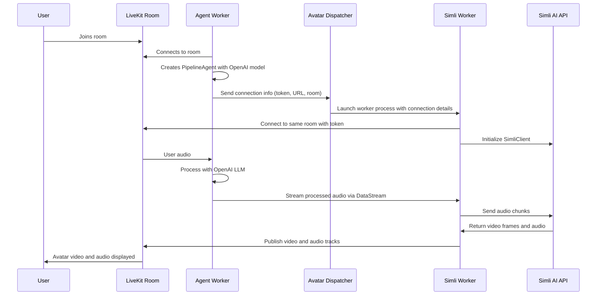

# LiveKit Simli Avatar Example

This example demonstrates how to create an animated avatar using Simli that responds to audio input using LiveKit's agent system. The avatar worker generates synchronized video based on received audio input using the Simli AI API.

## Architecture Overview

This example consists of three main components:

1. **Agent Worker** - The main LiveKit agent that processes room audio and coordinates with the avatar system
2. **Avatar Dispatcher** - A FastAPI server that manages avatar worker processes
3. **Simli Worker** - Handles avatar generation by sending audio to Simli API and publishing the resulting video
	* In the future this is provided by the Avatar service (Simli in this case)

## How it Works

1. The agent worker connects to a LiveKit room and creates a PipelineAgent with OpenAI's realtime model
2. The agent sends connection info (including token, room name, and URL) to the avatar dispatcher server
3. The dispatcher launches a Simli avatar worker process for that room
4. The agent streams audio to the avatar worker using LiveKit's DataStream
5. The Simli worker:
   - Receives the audio stream from the agent
   - Sends the audio to Simli's API service
   - Receives synchronized video and audio frames from Simli
   - Publishes both the audio and video back to the LiveKit room via direct LiveKit (*WebRTC*) tracks

## Detailed Call Flow



## Component Details

### Agent Worker (`agent_worker.py`)
- Creates a PipelineAgent with OpenAI's realtime model, you can configure other models
- Generates a secure token for the avatar worker
- Sends connection details to the dispatcher
- Routes audio to the avatar worker through DataStream

### Avatar Dispatcher (`dispatcher.py`)
- FastAPI server that listens for avatar worker launch requests
- Manages the lifecycle of avatar worker processes
- Launches and monitors Simli worker subprocesses

### Simli Worker (`simli_avatar_runner.py`)
- Connects to the LiveKit room using the provided token
- Initializes SimliClient with API key and face ID
- Processes incoming audio streams and sends them to Simli API
- Receives generated avatar video and audio from Simli
- Publishes synchronized media back to the LiveKit room

### Direct Integration Example (`integrated_agent_worker.py`)
- Combines the agent and avatar in a single process
- Uses a queue-based audio sink instead of DataStream
- Publish synchronized media to the LiveKit room from the agent process


## Usage

* Start the avatar dispatcher server:
```bash
python examples/simli_avatar/dispatcher.py [--port 8089]
```

* Start the agent worker:

```bash
python examples/simli_avatar/agent_worker.py dev [--avatar-url http://localhost:8089/launch]
```

* To use your own Simli avatar, update the environment variables:

```bash
# Simli Config
export SIMLI_API_KEY="your-api-key"
export SIMLI_FACE_ID="your-face-id"

# OpenAI config (or other models, tts, stt)
export OPENAI_API_KEY="your-openai-api-key"

# LiveKit config
export LIVEKIT_API_KEY
export LIVEKIT_API_SECRET
LIVEKIT_URL
```

## Requirements

This example requires the following dependencies:
- The Simli AI package with LiveKit support
- LiveKit server and agent system
- FastAPI and Uvicorn for the dispatcher server

You can install all required dependencies using:

```bash
pip install -r examples/simli_avatar/requirements.txt
```

## Note 

* If you install av>=13 you need to change simli library [util.py](https://github.com/simliai/simli-client-py/blob/master/simli/utils.py#L6) `layout=1` -> `layout="mono"`
* You can create your own custom avatar at [app.simli.com](https://app.simli.com)
* Available pre-made avatars can be found at [docs.simli.com/api-reference/available-faces](https://docs.simli.com/api-reference/available-faces) 