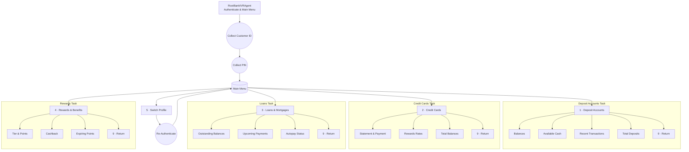

# Horizon Bank IVR Example

This example mirrors the telecom IVR demo but shifts the narrative to a retail banking assistant. It showcases:

- A `MockBankService` that exposes read-only customer data for checking/savings accounts, credit cards, loans, and rewards.
- A multi-agent IVR tree where the root agent authenticates callers and hands off to submenu tasks implemented with `AgentTask` for each banking domain.
- Voice-ready prompts and DTMF collection using the LiveKit agents toolkit.

## IVR Flow



Run the mock service tests with:

```bash
uv run pytest examples/bank-ivr/test_mock_bank_service.py
```

Launch the IVR worker with:

```bash
uv run python examples/bank-ivr/agent.py dev
```

