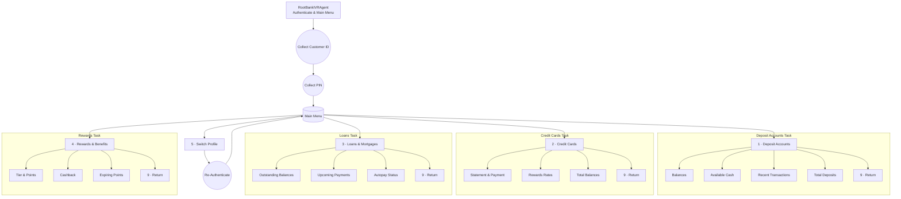

# Bank IVR Example

This example reenvisions the LiveKit telecom demo as a retail banking assistant. It combines a scripted IVR tree, a DTMF helper agent, and a mock banking backend so you can experiment with full call flows—authentication, menu navigation, and data lookups—without touching production systems.

## What's Included

- Read-only banking data served by `MockBankService`, covering deposits, credit cards, loans, and rewards.
- A multi-agent IVR implemented with LiveKit Agents. The main `agent.py` orchestrates authentication, menu routing, and task execution.
- A DTMF-focused assistant (`dtmf_agent.py`) that reads the caller's intent from dispatch metadata and presses keypad digits on the caller's behalf.
- A dialer script (`dial_bank_agent.py`) that provisions a LiveKit dispatch, embeds the user's request, and places an outbound SIP call.

## File Tour

- `agent.py` - primary IVR worker. Hosts the authentication flow, menu prompts, and per-domain tasks.
- `dtmf_agent.py` - companion agent dedicated to DTMF entry. Pulls the request from `ctx.room.metadata`, drives the IVR with keypad events, and records the outcome.
- `dial_bank_agent.py` - command-line helper that triggers a dispatch and SIP call. Accepts `--phone` and `--request` so you can enqueue different intents.
- `mock_bank_service.py` - loads structured customer data from `data.json` into immutable dataclasses for safe read access.
- `data.json` - sample dataset featuring two customers with realistic balances, transactions, cards, loans, and rewards.
- `test_mock_bank_service.py` - pytest coverage for the data service and formatting helpers.

## How the Flow Works

1. `dial_bank_agent.py` creates a dispatch targeting `PHONE_TREE_AGENT_DISPATCH_NAME`, attaches the user's request as metadata, and dials the IVR through your LiveKit SIP trunk.
2. `agent.py` answers the call, authenticates the customer, and consults `MockBankService` to fulfill each IVR menu option.
3. `dtmf_agent.py` receives the same dispatch, sees the requested task in the metadata, sends keypad digits via `send_dtmf_events`, and logs progress using `record_task_result_and_hang_up`.
4. When the task finishes, the DTMF agent records a summary and gracefully ends the session, ensuring the call does not linger.

## IVR Flow

## Run It Yourself

1. **Verify the dataset** - edit `examples/bank-ivr/data.json` if you need different customers.
2. **Run the unit tests** - `uv run pytest examples/bank-ivr/test_mock_bank_service.py` confirms the mock service and helpers are healthy.
3. **Start the IVR worker** - `uv run python examples/bank-ivr/agent.py dev` hosts the IVR and webhook.
4. **Start the DTMF assistant** - open another terminal and run `uv run python examples/bank-ivr/dtmf_agent.py` so keypad commands are available.
5. **Place the outbound call** - `uv run python examples/bank-ivr/dial_bank_agent.py --phone "+12132896618" --request "check balance for all accounts I have"`. Both flags are optional; defaults dial the demo number and request a balance check. The request string lives in dispatch metadata and becomes visible to both agents.

Set `SIP_OUTBOUND_TRUNK_ID` to a valid LiveKit SIP trunk identifier before running the dialer. Without it the script logs an error and exits early.

## Customize the Demo

- Add more customer profiles or transactions in `data.json` and extend `MockBankService` if you need new fields.
- Dial the IVR to different tasks by passing a different `--request` to the dialer.

