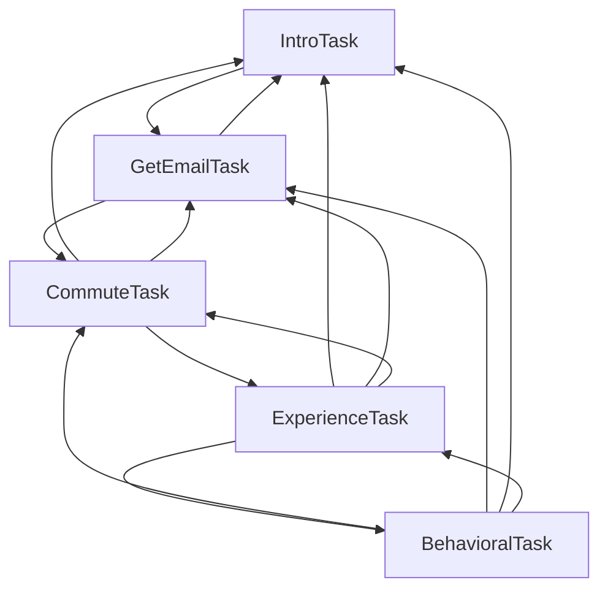

# Survey Agent

Screen a candidate for a software engineer role to see if they meet the prerequisites and are an overall good fit. The responses, summary, and evaluation will be written to a CSV file.

For setup instructions and more details, see the [main examples README](../README.md).

## Overview

The flow of this agent is flexibly structured, where the specified sequence is maintained but the user is able to regress to a previously visited task if needed. This is possible via `TaskGroup`, which is set up here: https://github.com/livekit/agents/blob/f8efe436afe2470104ce7587f1d89ae383ed619e/examples/survey/survey_agent.py#L285-L315




### IntroTask
This stage facilitates introductions and collects the candidate’s name.

### GetEmailTask
This task is built in to our framework. By default, it can collect and update emails and mark when a user doesn’t want to give their email. If the input modality is audio, emails are confirmed before the task is marked as complete.

### CommuteTask
This stage collects whether or not the candidate can commute to the office and their method of transportation.

### ExperienceTask
This stage collects the candidate’s years of experience and a short description of their professional career. It follows a structure similar to `IntroTask` and `CommuteTask`.

### BehavioralTask
For some tasks, you might not want a structured flow of questions. In this stage, we are collecting the candidate’s strengths, weaknesses, and work style. This task incrementally collects answers in no particular order. This allows for a more natural conversation.

After the candidate answers one of the questions, `self._check_completion()` is called to check if all 3 fields (`”strengths”`, `“weaknesses”`, `“work_style”`) have been collected. If so, then `BehavioralTask` is marked as complete. If not, then the agent will continue prompting for the rest of the answers.

In practice, this would ensure variability among candidates’ experiences.

### Closing out
Once the interview is concluded and TaskGroup is completed, we extract the summary message (the last inserted message):

```python
summary = self.chat_ctx.items[-1]
```

And we generate a candidate evaluation based off of the summary:

```python
evaluation = await evaluate_candidate(llm_model=self.session.llm, summary=summary)
```

Finally, the agent hangs up and you can find the results, summary, and evaluation in `results.csv`!


