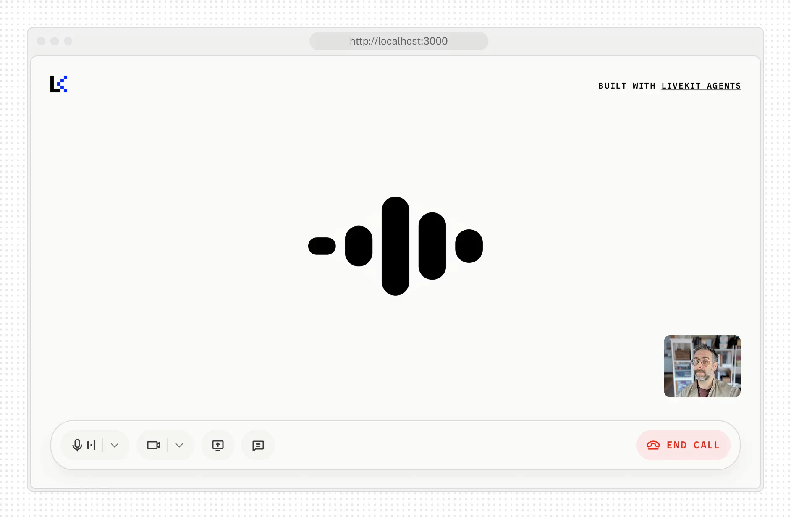

# Agent Starter for React

This is a starter template for [LiveKit Agents](https://docs.livekit.io/agents) that provides a simple voice interface using [Agents UI](https://livekit.io/ui) components and [LiveKit JavaScript SDK](https://github.com/livekit/client-sdk-js). It supports [voice](https://docs.livekit.io/agents/start/voice-ai), [transcriptions](https://docs.livekit.io/agents/build/text/), and [virtual avatars](https://docs.livekit.io/agents/integrations/avatar).

Also available for:
[Android](https://github.com/livekit-examples/agent-starter-android) • [Flutter](https://github.com/livekit-examples/agent-starter-flutter) • [Swift](https://github.com/livekit-examples/agent-starter-swift) • [React Native](https://github.com/livekit-examples/agent-starter-react-native)

<picture>
  <source srcset="./.github/assets/readme-hero-dark.webp" media="(prefers-color-scheme: dark)">
  <source srcset="./.github/assets/readme-hero-light.webp" media="(prefers-color-scheme: light)">
  
</picture>

### Features:

- Real-time voice interaction with LiveKit Agents
- Camera video streaming support
- Screen sharing capabilities
- Audio visualization and level monitoring
- Virtual avatar integration
- Light/dark theme switching with system preference detection
- Customizable branding, colors, and UI text via configuration

This template is built with Next.js and is free for you to use or modify as you see fit.

### Project structure

This starter uses the [Agents UI](https://livekit.io/ui) components for core UI elements like media controls, audio visualizers, chat transcripts, and providing session data. Shadcn installs components into `components/` folder so you can customize them like any other local component.

```
agent-starter-react/
├── app/
│   ├── api/
├── components/
│   ├── agents-ui/     - Agents UI components
│   ├── ai-elements/   - AI Elements components
│   ├── app/           - App-specific components
│   ├── ui/            - Primitive shadcn/ui components
├── fonts/
├── hooks/
├── lib/
├── public/
└── package.json
```

Business logic lives within the `components/app` folder. It's here where the application's state and behavior is managed and the various Shadcn UI components are composed together.

| File                  | Description                                                                                                                                           |
| --------------------- | ----------------------------------------------------------------------------------------------------------------------------------------------------- |
| `session-view.tsx`    | Initializes the application, and LiveKit session. Renders the view controller and session UI including chat transcript, media tiles, and control bar. |
| `view-controller.tsx` | Manages the transitions between the welcome and session views based on the LiveKit session state.                                                     |
| `welcome-view.tsx`    | Renders the welcome UI when the LiveKit session is not connected.                                                                                     |
| `chat-transcript.tsx` | Manages the chat transcript transitions.                                                                                                              |
| `tile-layout.tsx`     | Manages the layout and transition of media tiles in various application states.                                                                       |

### Component usage

Most Agents UI components require access to a LiveKit session object for access to values like agent state or audio tracks. A Session object can be created from a [TokenSource](/reference/client-sdk-js/variables/TokenSource.html), and provided by wrapping the component in an [AgentSessionProvider](/reference/components/shadcn/component/agent-session-provider).

See [`components/app/app.tsx`](./components/app/app.tsx) for an example of how this is done in this app.

### Customizing components

Agents UI components, like most Shadcn compopnents, take as many primitive attributes as possible. For example, the [AgentControlBar](/reference/components/shadcn/component/agent-control-bar/page.mdoc) component extends `HTMLAttributes<HTMLDivElement>`, so you can pass any props that a div supports. This makes it easy to extend the component with your own styles or functionality.

You can edit any Agents UI component's source code in the `components/agents-ui` directory. For style changes, we recommend passing in tailwind classes to override the default styles. Take a look at the source code to get a sense of how to override a component's default styles.

### Updating components

To update the Agents UI components to the latest publication, run the following command:

```bash
pnpm shadcn:install
```

> [!NOTE]
> The CLI will ask before overwriting any modified files so you can avoid losing any customizations you might have made.

### Installing components

```bash
pnpm dlx shadcn@latest add @agents-ui/{component-name-a} @agents-ui/{component-name-b}
```

## Getting started

> [!TIP]
> If you'd like to try this application without modification, you can deploy an instance in just a few clicks with [LiveKit Cloud Sandbox](https://cloud.livekit.io/projects/p_/sandbox/templates/agent-starter-react).

[](https://cloud.livekit.io/projects/p_/sandbox/templates/agent-starter-react)

Run the following command to automatically clone this template.

```bash
lk app create --template agent-starter-react
```

Then run the app with:

```bash
pnpm install
pnpm dev
```

And open http://localhost:3000 in your browser.

You'll also need an agent to speak with. Try our starter agent for [Python](https://github.com/livekit-examples/agent-starter-python), [Node.js](https://github.com/livekit-examples/agent-starter-node), or [create your own from scratch](https://docs.livekit.io/agents/start/voice-ai/).

## Configuration

This starter is designed to be flexible so you can adapt it to your specific agent use case. You can easily configure it to work with different types of inputs and outputs:

#### Example: App configuration (`app-config.ts`)

```ts
export const APP_CONFIG_DEFAULTS: AppConfig = {
  companyName: 'LiveKit',
  pageTitle: 'LiveKit Voice Agent',
  pageDescription: 'A voice agent built with LiveKit',

  supportsChatInput: true,
  supportsVideoInput: true,
  supportsScreenShare: true,
  isPreConnectBufferEnabled: true,

  logo: '/lk-logo.svg',
  accent: '#002cf2',
  logoDark: '/lk-logo-dark.svg',
  accentDark: '#1fd5f9',
  startButtonText: 'Start call',

  // agent dispatch configuration
  agentName: undefined,

  // LiveKit Cloud Sandbox configuration
  sandboxId: undefined,
};
```

You can update these values in [`app-config.ts`](./app-config.ts) to customize branding, features, and UI text for your deployment.

> [!NOTE]
> The `sandboxId` is for the LiveKit Cloud Sandbox environment.
> It is not used for local development.

#### Environment Variables

You'll also need to configure your LiveKit credentials in `.env.local` (copy `.env.example` if you don't have one):

```env
LIVEKIT_API_KEY=your_livekit_api_key
LIVEKIT_API_SECRET=your_livekit_api_secret
LIVEKIT_URL=https://your-livekit-server-url

# Agent dispatch (https://docs.livekit.io/agents/server/agent-dispatch)
# Leave AGENT_NAME blank to enable automatic dispatch
# Provide an agent name to enable explicit dispatch
AGENT_NAME=
```

These are required for the voice agent functionality to work with your LiveKit project.

## Contributing

This template is open source and we welcome contributions! Please open a PR or issue through GitHub, and don't forget to join us in the [LiveKit Community Slack](https://livekit.io/join-slack)!
